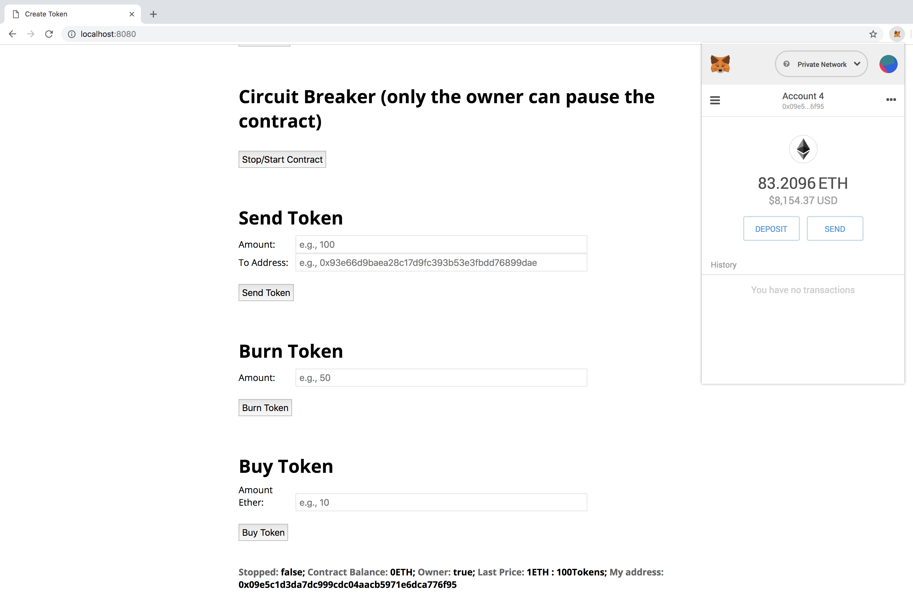
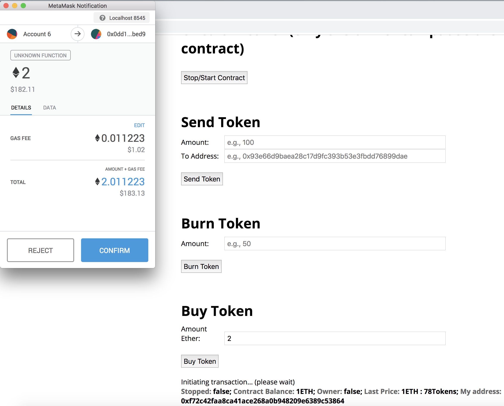
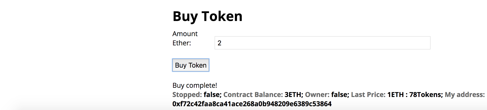
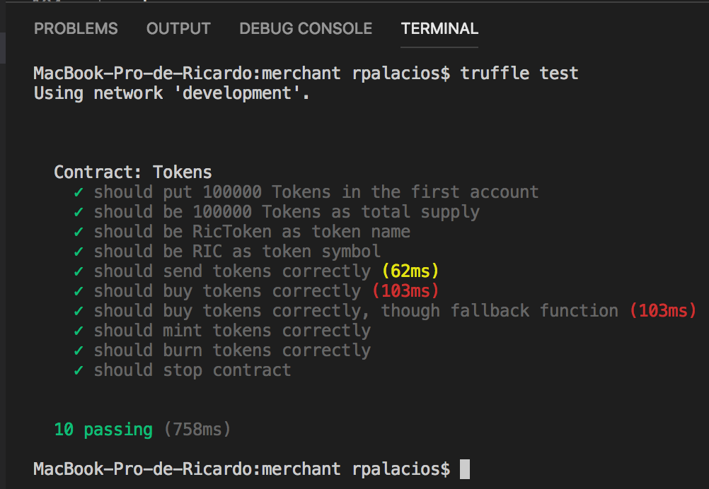
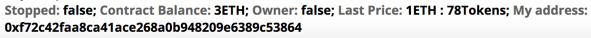

# pfm-merchant
# PEC 3

## Merchant Token

> En el PEC3 de Diseño y Desarrollo, hemos creado un Smart Contract [merchant](https://github.com/rpmaya/uah-ethereum/tree/master/Pec3/merchant), que permite la creación y edición ("name", "symbol" y "supply") de un token propio, con las funcionalidades básicas de:

1. Send 
2. Buy
3. Mint (only by the owner)
4. Burn

> Para arrancar el smart contract en ganache-cli (blockchain local):

1. Ejecutamos ganache-cli con una regla nemotécnica para obtener siempre las mismas direcciones
```
# ganache-cli -m "El perro de San Roque”
```
2. Arrancamos ethereum-bridge (clonado previamente) para el uso de Oráculos:
```
# cd ethereum-bridge/
# node bridge -a 9 
```
(Toma la address 10)

3. Compilamos y desplegamos nuestros smart contracts (para desplegar requiere que esté levantado ganache-cli en el 8545 y el servicio de ethereum-bridge):
```
# truffle compile && truffle migrate
```

4. Arrancamos un servidor web local:
```
# npm run dev
```

5. Podemos acceder a nuestro servidor web local en 
http://localhost:8545

> A continuación pasamos a detallar cada una de las partes:

INTERFAZ:


> Donde se tiene que:

1. La aplicación ejecuta en un servidor local: http://localhost:8080
2. Desde un navegador se realiza una carga correcta de la aplicación
3. Interacción con la aplicación (botones y campos de texto)
4. Se muestra la address actual (en el footer de la página)
5. Se refresca automáticamente la web cuando se cambia de address
    -   En [index.js](https://github.com/rpmaya/uah-ethereum/blob/master/Pec3/merchant/app/scripts/index.js) añadimos el siguiente código [FAQ Metamask](https://github.com/MetaMask/faq/blob/master/DEVELOPERS.md#ear-listening-for-selected-account-changes):
```
var accountInterval = setInterval(function() {
    if (web3.eth.accounts[0] !== account) {
      account = web3.eth.accounts[0];
      window.location.reload();
    }
  }, 100);
```

6. Firmar transacciones usando MetaMask: Donde al introducir el número de ether a enviar para comprar Token, se nos muestra la confirmación en Metamask y se informa al usuario con "Initiating transaction...(please wait)" justo debajo del botón "Buy Token"
   


7. Guiar al usuario: Por ejemplo, una vez realizada la transacción, se le informa al usuario con "Buy Complete!" en el mismo lugar.




LIBRERÍA
1. Se usa la librería [ConvertLib.sol](https://github.com/rpmaya/uah-ethereum/blob/master/Pec3/merchant/contracts/ConvertLib.sol), para ello añadimos:
   -  En [Tokens.sol](https://github.com/rpmaya/uah-ethereum/blob/master/Pec3/merchant/contracts/Tokens.sol):
```
import "./ConvertLib.sol";
...
uint amount = ConvertLib.convert(_amount, price);
...
```
  - En [2_deploy_contracts.js](https://github.com/rpmaya/uah-ethereum/blob/master/Pec3/merchant/migrations/2_deploy_contracts.js):
```
var ConvertLib = artifacts.require('./ConvertLib.sol')
...
module.exports = function (deployer, network, accounts) {
  deployer.deploy(ConvertLib)
  deployer.link(ConvertLib, Tokens)
  ...
``` 

SMART CONTRACTS
1. Uso de herencia
   - Heredamos de los smart contacts [usingOraclize.sol](https://github.com/rpmaya/uah-ethereum/blob/master/Pec3/merchant/contracts/usingOraclize.sol) y [Owned.sol](https://github.com/rpmaya/uah-ethereum/blob/master/Pec3/merchant/contracts/Owned.sol), para ello añadimos en [Tokens.sol](https://github.com/rpmaya/uah-ethereum/blob/master/Pec3/merchant/contracts/Tokens.sol):
```
import "./Owned.sol";
import "./usingOraclize.sol";
...
contract Tokens is Owned, usingOraclize {
...
}
```  
2. Implementación de parada de emergencia
   - En [Tokens.sol](https://github.com/rpmaya/uah-ethereum/blob/master/Pec3/merchant/contracts/Tokens.sol):
```
bool private stopped = false;
modifier notStopped {if(!stopped) _;}
...
function breaker() public onlyOwner {
        stopped = !stopped;
}
//En las funciones que queramos parar o reactivar añadimos "notStopped" tal que, por ejemplo:
function X (...) public notStopped {...}
```
3. Medidas de seguridad ante ataques típicos
   - En [Tokens.sol](https://github.com/rpmaya/uah-ethereum/blob/master/Pec3/merchant/contracts/Tokens.sol), cuando vamos a realizar una transferencia aplicamos los siguientes requires:
```
function _transfer(address _from, address _to, uint256 _value) internal notStopped {
        // Prevent transfer to 0x0 address. Use burn() instead
        require(_to != 0x0);
        // Check if the sender has enough
        require(balanceOf[_from] >= _value);
        // Check for overflows
        require(balanceOf[_to] + _value >= balanceOf[_to]);
        ...
```
4. Un método para actualizar contratos podría ser utilizar un sistema de versiones. Por ejemplo, podría tener un contrato de entrada que, simplemente, reenvíe todas las llamadas a la versión más reciente del contrato. Otro método sería introducir el código en una biblioteca, para después usar la función CALLCODE para llamar al código ubicado en una dirección específica y actualizable. De esta manera, los datos persistirían entre versiones. Por ejemplo, podríamos utilizar la operación DELEGATECALL que permite reenviar llamadas a otro contrato manteniendo el msg.sender y el almacenamiento. Para mayor detalle, véase https://blog.zeppelin.solutions/proxy-libraries-in-solidity-79fbe4b970fd
      
5. Comentarios
   - En nuestro Smart Contract [Tokens.sol](https://github.com/rpmaya/uah-ethereum/blob/master/Pec3/merchant/contracts/Tokens.sol), realizamos comentarios para las funciones públicas tal que, por ejemplo:
```
/**
     * @dev Destroy tokens: Remove `_value` tokens from the system irreversibly
     * @param _value the amount of tokens to burn
     * @return success If the transaction was fine.
     */
    function burn(uint256 _value) public notStopped returns (bool success) {...}
```

TESTING



- Cuando se despliega el contrato, al constructor le pasamos como parámetros el "Supply", el "Name" y el "Symbol" del Token:
  1. Should put 100000 Tokens in the first account: Comprueba que en la cuenta inicial (owner), tiene asignado todo el "supply".
  2. Should be 10000 Tokens as total supply: Comprueba el "suppy".
  3. Should be RicToken as token name: Comprueba el "name".
  4. Should be RIC as token name: Comprueba el "symbol".

- Comprobamos que se pueden enviar correctamente tokens desde una cuenta X a una cuenta Y:
  1. Should send tokens correctly: Obtenemos los balances iniciales de las cuentas X e Y (direcciones 0 y 1 en este caso) llamando a nuestra función balanceOf. Después llamamos a la función transfer con 100 Tokens como amount. Y volvemos a comprobar los balances. Donde la cuenta X debería tener 100 Tokens menos y la cuenta Y 100 Tokens más.

- Comprobamos que se pueden comprar Tokens correctamente con Ether:
  1. Should buy tokens correctly: Se obtienen los balances iniciales del owner del contrato (account[0]) y del comprador (account[2]) de Tokens. Después llamamos a la función buy para comprar Tokens con 3 Ethers. Se vuelve a obtener los balances y a través del Oráculo obtenemos la Conversión (precio ETH/EUR) que se multiplicará por el amount (3), y ese será el número de Tokens comprados. Se comprueba que la cuenta del propietario tiene ese número de Tokens comprados  de menos, así como el comprador de más, comparado con sus balances iniciales.
  2. Should buy tokens correctly, though fallback function: Lo mismo que la anterior, pero en este caso llamamos a la función de web3 sendTransaction con 2ETH para probar nuestra función anónima de fallback (la cual, al igual que la función pública buy, llamará a la función interna _buy).

- Comprobamos que se pueden forjar y quemar nuevos Tokens:
  1. Should mint tokens correctly: Obtiene el supply inicial a través de la función totalSupply. Después se llama a la función mint con 1000 como parámetro (amount). Y después de obtener nuevamente el supply, se comprueba que ahora este es el inicial más los 1000 (amount) nuevos forjados.
  2. Should burn tokens correctly: Lo mismo que el anterior, pero en esta ocasión comprobamos que el supply es el inicial menos los 1000 (amount) quemados.

- Comprobamos la funcionalidad "circuit breaker":
  1. Llamamos a la función breaker que debe poner la variable isStopped a true (con esta variable a true no se podrán realizar ciertas operaciones en el contrato: modifier notStopped). 

EXTRAS
1. Uso de Oráculos
   - Como vamos a ejecutar sobre una blockchain de test local (ganache-cli), vamos a necesitar ethereum-bridge, para ello lo clonamos a nuestro local tal que:
```
git clone https://github.com/oraclize/ethereum-bridge.git
```
  - Para lanzar nuestra blockchain local siempre con las mismas direcciones ejecutamos
```
ganache-cli -m "<texto cualquiera>"
```
Por ejemplo, en nuestro caso (es también útil para Metamask, solo importamos cuentas una vez):
```
ganache-cli -m "El perro de San Roque"
```
  - Ahora lanzamos ethereum-bridge con la última dirección, la décima del array:
```
cd ethereum-bridge/
node bridge -a 9 
```
  - Esperamos hasta ver algo como (y guardamos el valor de OAR):
```
Please add this line to your contract constructor:

OAR = OraclizeAddrResolverI(0x6f485C8BF6fc43eA212E93BBF8ce046C7f1cb475);
```

 - Ahora descargamos [OraclizeAPI](https://github.com/oraclize/ethereum-api/blob/master/oraclizeAPI_0.4.25.sol) y lo renombramos como "usingOraclize.sol" dentro de nuestro directorio de contratos.

- Por último, escribimos el siguiente código en [Tokens.sol](https://github.com/rpmaya/uah-ethereum/blob/master/Pec3/merchant/contracts/Tokens.sol):
```
import "./usingOraclize.sol";
...
contract Tokens is usingOraclize ... {
...
  constructor(...) public {
        OAR = OraclizeAddrResolverI(0x6f485C8BF6fc43eA212E93BBF8ce046C7f1cb475); // For testing only, remove in production
        ...
}
  ...
  function __callback(bytes32 _myid, string _result) public {
        require (msg.sender == oraclize_cbAddress());
        bytes memory tempEmptyStringTest = bytes(_result); // Uses memory
        if (tempEmptyStringTest.length > 0) //Just updates the price if receives data from Oracle, otherwise keeps the last value
            price = parseInt(_result);
    }  

  function update() public payable {
        oraclize_query("URL","json(https://min-api.cryptocompare.com/data/price?fsym=ETH&tsyms=EUR).EUR");
    }
```
  - Es decir, consulta el precio ETH/EUR en min-api.cryptocompare.com para mantener el precio de nuestro Token fijo al EURO. Por ejemplo, si 1ETH vale 80EUR, al comprar nuestro Token con ETH, para cada ETH recibiremos 80 Tokens. Por tanto, si compráramos 2ETH, recibiríamos 160 de nuestros Tokens (si el precio ETH/EUR es de 80). El precio ETH/EUR se actualiza antes de cada compra.

  - En el footer de la página, vemos que el precio del Ether en el momento de la captura a través del Oráculo es de 78 Euros, por tanto con 1ETH podremos comprar 78 Tokens (Last Price).



 - Si hubiese algún problema con el Oráculo, se mantendría el último valor válido que tuviese.

